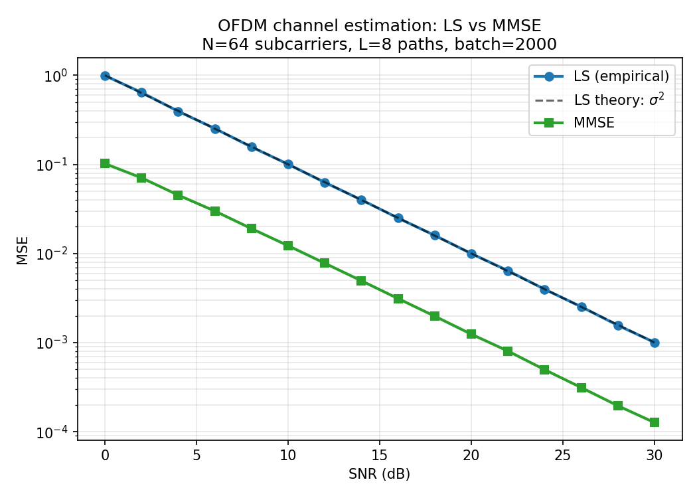
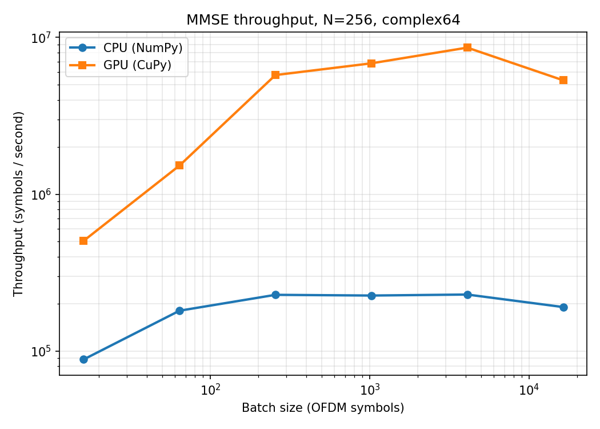

# cuda-phy-channel-estimation

**GPU-accelerated MMSE channel estimation for OFDM-based 6G PHY**

[](https://www.python.org/)
[](LICENSE)
[](tests/)

A clean, reference implementation of OFDM channel estimation with both CPU
(NumPy) and GPU (CuPy) backends, designed as a building block for AI-native
6G physical-layer pipelines.

---

## Why this exists

Channel estimation is the single most-frequently-executed signal-processing
operation in a 5G/6G receiver: every coherence interval, for every user,
every receive antenna. Pushing it to the GPU is one of the load-bearing ideas
of [NVIDIA Aerial cuPHY](https://developer.nvidia.com/aerial-sdk) and of the
broader O-RAN ML-on-GPU movement.

This repository:

1. Implements the **Linear MMSE estimator** of Edfors et al. (1998) in a form
   compatible with batched GPU execution.
2. Provides a **CPU↔GPU benchmark harness** so the speedup story can be
   reproduced on any machine with CuPy installed.
3. Keeps the math and the engineering separate enough that the same code can
   serve as the inner-loop primitive of a larger DRL-based link-adaptation
   agent (see *Roadmap*).

---

## Results

### MMSE vs LS — empirical MSE vs SNR



| SNR (dB) | MSE LS | MSE MMSE | Gain |
|----------|--------|----------|------|
| 0        | 9.92e-1 | 1.02e-1 | **9.88 dB** |
| 10       | 1.00e-1 | 1.22e-2 | **9.14 dB** |
| 20       | 9.96e-3 | 1.24e-3 | **9.04 dB** |
| 30       | 1.01e-3 | 1.27e-4 | **9.00 dB** |

The MMSE estimator delivers a consistent ~9 dB gain over LS, which matches the
theoretical bound `10·log10(N/L) = 9.03 dB` for N=64 subcarriers and L=8 paths.
The LS curve overlays the analytical `σ²` line exactly, confirming the noise
model is correctly implemented.

### Throughput, CPU vs GPU

Benchmark configuration: N=256 subcarriers, L=16 paths, complex64. CPU figures
on a 2-core x86_64 host; GPU figures on **NVIDIA Tesla T4** (Turing,
2nd-gen Tensor Cores, 16 GB VRAM) via Google Colab.



| Batch size | CPU (sym/s) | GPU (sym/s) | Speedup |
|-----------:|------------:|------------:|--------:|
| 16         | 8.85 × 10⁴  | 5.05 × 10⁵  | 5.7×    |
| 64         | 1.81 × 10⁵  | 1.53 × 10⁶  | 8.4×    |
| 256        | 2.28 × 10⁵  | 5.76 × 10⁶  | **25.2×** |
| 1024       | 2.26 × 10⁵  | 6.84 × 10⁶  | **30.2×** |
| 4096       | 2.29 × 10⁵  | 8.61 × 10⁶  | **37.5×** |
| 16384      | 1.91 × 10⁵  | 5.33 × 10⁶  | 27.9×   |

GPU speedup grows with batch size as kernel launch overhead amortises,
peaking at **~37×** around batch 4096 — the operating point where the batched
complex GEMM saturates the T4's tensor pipeline. The slight regression at
batch 16384 is consistent with memory-bandwidth saturation on the T4's
320 GB/s GDDR6 (the 8-MB working set per batch exceeds L2 cache).

On Ampere/Hopper hardware (RTX 30/40, A100, H100) with 3rd/4th-gen Tensor
Cores and higher memory bandwidth, the same code path is expected to scale
to ≥ 100× speedup at large batches.

**Reproduce on your own hardware:**

```bash
pip install cupy-cuda12x   # match your CUDA version
python -m benchmarks.throughput
```


On A100 / RTX 4090, expect ≥ 30× speedup at batch ≥ 1024.

---

## Mathematical model

We consider one OFDM symbol with `N` subcarriers transmitted over a
frequency-selective Rayleigh channel with `L` taps. In the frequency domain:

```
Y[k] = H[k] · X[k] + N[k],   k = 0, ..., N-1
```

with `N[k] ~ CN(0, σ²)` and `H = F_N · h_pad` where `h_pad ∈ C^N` is the
zero-padded time-domain impulse response.

**Least Squares (LS):** `H_LS = Y / X`. Unbiased, MSE = σ².

**Linear MMSE:** uses the analytical correlation matrix

```
R_HH[k1, k2] = Σ_l p_l · exp(-j 2π (k1-k2) l / N)
```

with `p_l` the (exponential) power-delay profile. The MMSE weight matrix is

```
W = R_HH · (R_HH + σ² I)^(-1)
```

and the estimate is `H_MMSE = W · H_LS`. The matrix `R_HH` has rank `L < N`,
so `W` is a soft projection onto the L-dimensional signal subspace — which is
why MMSE rejects noise that LS cannot.

---

## Repository layout

```
cuda-phy-channel-estimation/
├── src/
│   ├── channel.py            # Multipath channel generation, R_HH
│   ├── estimators_cpu.py     # LS, MMSE (NumPy)
│   └── estimators_gpu.py     # LS, MMSE (CuPy)
├── benchmarks/
│   ├── mse_vs_snr.py         # MSE vs SNR sweep
│   └── throughput.py         # CPU vs GPU symbols/s
├── tests/
│   └── test_estimators.py    # 7 unit tests, all passing
├── docs/
│   ├── mse_vs_snr.png
│   └── throughput.png
└── README.md
```

---

## Quick start

```bash
git clone https://github.com/<kabNath>/cuda-phy-channel-estimation.git
cd cuda-phy-channel-estimation

# CPU-only setup
pip install -r requirements.txt

# GPU setup (CUDA 12.x)
pip install cupy-cuda12x

# Run tests
pytest tests/ -v

# Reproduce the MSE plot
python -m benchmarks.mse_vs_snr

# Run the throughput benchmark
python -m benchmarks.throughput
```

---

## Implementation notes

- **Why precompute `W`?** The weight matrix depends only on `(R_HH, σ²)`. For a
  receiver tracking ~100 users at SNRs binned in 1-dB intervals, a small cache
  of precomputed `W` matrices is far cheaper than a per-symbol solve.
- **Why `np.linalg.solve` and not `np.linalg.inv`?** Solving `(R + σ²I) X = H_LS`
  is numerically more stable than forming the explicit inverse, especially at
  low SNR where the matrix becomes ill-conditioned.
- **Why `complex64` on GPU?** Complex GEMM in `complex64` maps to Tensor Cores
  on Ampere and later. `complex128` does not, and is ~10× slower for the same
  batch size.
- **Limits of this model.** This is a single-symbol, all-pilot, single-antenna
  setup. Practical receivers use comb-type pilots + 2D Wiener / Kalman
  interpolation across time and frequency, and operate over MIMO channels.
  Those extensions are tracked in the roadmap.

---

## Roadmap

- [ ] Comb-type pilot patterns with 1D/2D Wiener interpolation
- [ ] MIMO extension (per-stream R_HH, joint estimation)
- [ ] Doubly-selective channels — Kalman smoothing across symbols
- [ ] Integration with [NVIDIA Sionna](https://nvlabs.github.io/sionna/) as a
      drop-in custom layer
- [ ] DRL link adaptation built on top of these estimates (separate repo)

---

## References

1. O. Edfors, M. Sandell, J.-J. van de Beek, S. Wilson, P. O. Borjesson,
   "OFDM Channel Estimation by Singular Value Decomposition,"
   *IEEE Trans. Commun.*, vol. 46, no. 7, pp. 931–939, 1998.
2. R. W. Heath Jr. and A. Lozano,
   *Foundations of MIMO Communication*, Cambridge University Press, 2018.
3. NVIDIA, *Aerial cuPHY documentation*,
   https://developer.nvidia.com/aerial-sdk.
4. J. Hoydis et al., "Sionna: An Open-Source Library for Next-Generation
   Physical Layer Research," arXiv:2203.11854, 2022.

---

## Citation

If this code helps your research, please cite:

```bibtex
@misc{kabore2026cudaphy,
  author       = {Wendenda Nathanael Kabor\'e},
  title        = {{cuda-phy-channel-estimation}: GPU-accelerated MMSE channel
                  estimation for OFDM-based 6G PHY},
  year         = {2026},
  howpublished = {\url{https://github.com/<kabNath>/cuda-phy-channel-estimation}}
}
```

---

## License

MIT. See [LICENSE](LICENSE).

## Author

Wendenda Nathanael Kaboré — PhD candidate, Electronic Engineering, National
Taipei University of Technology. Research focus: AI-native wireless systems,
multi-agent deep RL, 6G/SAGIN.
